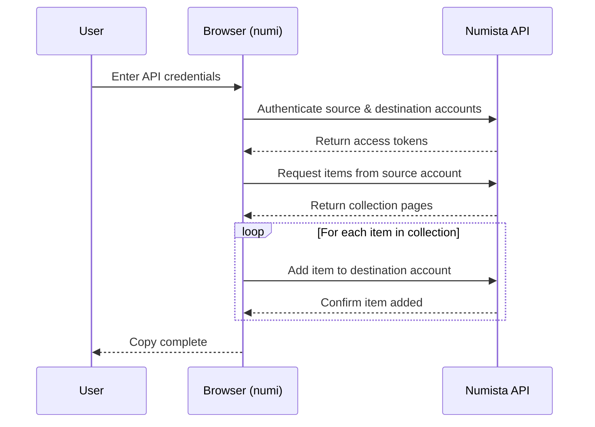

# numi

[](https://tjiuce.github.io/numi)
[](https://github.com/tjiuce/numi/stargazers)
[](https://github.com/tjiuce/numi)
[](https://opensource.org/licenses/MIT)

Safely and instantly copy your entire Numista collection from one account to another.

## Overview

numi is a secure, client-side web application built to help Numista collectors seamlessly copy their coin and banknote collections across different accounts. Whether you're consolidating profiles or migrating to a new account, numi automates the process securely without missing a single item.

## How It Works

numi uses the official Numista API to securely read from your source account and write to your destination account. All data transfer happens directly between your browser and Numista's servers.



## Features

- **Client-Side Execution**: Your Numista API keys and credentials never leave your browser. All API requests are made directly from your machine to Numista's servers.
- **Live Console Logs**: Watch the copy process happen in real-time with an integrated console interface.

## Limitations and Edge Cases

| Scenario / Feature          | Limit / Behavior      | Description                                                                                                                                                              |
| :----------------------------| :----------------------| :-------------------------------------------------------------------------------------------------------------------------------------------------------------------------|
| **Maximum Collection Size** | 100 pages             | The app has a hard cap of fetching 100 pages of items from the source account to prevent browser freezing. Extremely large collections may need to be copied in batches. |
| **Authentication**          | OAuth 2.0             | Requires Client ID and API Secret for both source and destination accounts.                                                                                              |
| **Supported Item Data**     | Basic fields only     | Copies item type, issue, quantity, swap status, grade, and private comments. Other specialized fields or images may not be transferred.                                  |
| **Rate Limiting**           | API Dependent         | The copy speed depends on the Numista API rate limits. Large collections might take time to fully copy.                                                                  |
| **Duplicate Items**         | Potential Duplication | If run multiple times, it may add the same items again if the Numista API allows identical items to be added.                                                            |

## Tech Stack


## Running Locally

1. Clone the repository
2. Install dependencies:
   ```bash
   npm install
   ```
3. Set up your environment variables:
   Copy `.env.example` to `.env.local` and configure your Firebase keys if you wish to track global usage stats.
4. Start the development server:
   ```bash
   npm run dev
   ```
5. To build for production:
   ```bash
   npm run build
   ```

## Contributing to Documentation

The in-app documentation is powered by Markdown. To update the docs, simply edit the `src/docs.md` file. The application will automatically parse the Markdown, generate the sidebar navigation, and inject hover-links for all headings!
