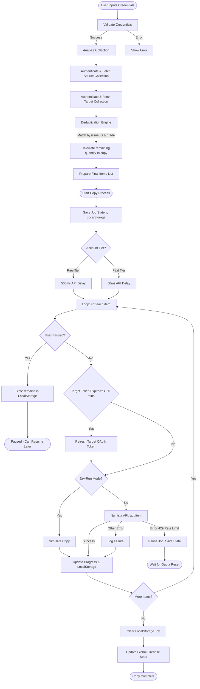

# numi

[](https://tjiuce.github.io/numi)
[](https://github.com/tjiuce/numi/stargazers)
[](https://github.com/tjiuce/numi)
[](https://opensource.org/licenses/MIT)

Safely and instantly copy your entire Numista collection from one account to another.

## Overview

**numi** is a secure, fully client-side web application designed to help Numista collectors seamlessly migrate, backup, or consolidate their coin and banknote collections across different accounts. 

Whether you're merging profiles or moving to a fresh account, numi automates the tedious process of manual entry without missing a single item. Built with privacy and reliability in mind, all API requests happen directly from your browser—your credentials are never stored on any server.

## Features

- **100% Client-Side Execution**: Your Numista API keys and user IDs never leave your browser. All Numista API interactions occur directly from your local machine.
- **Smart Deduplication Engine**: Automatically compares your source and target collections before copying. If the target already has the exact coin/grade, it skips it to prevent duplicates.
- **Pause & Resume**: Stop a large transfer mid-way and resume it perfectly later. The copy state is persistently saved in your browser's `localStorage`.
- **Live Console Logs**: Watch the validation, deduplication, and copy process happen in real-time with an integrated, color-coded console interface.
- **Dry-Run Mode**: Safely test the extraction and deduplication engine without actually modifying your target collection.
- **Failure Exporting**: Instantly download a JSON report of any items that failed to copy due to API timeouts or network drops.
- **Tiered Execution**: Supports both Free and Paid/Premium Numista API tiers, optimizing request delays (500ms vs 50ms) to respect rate limits.
- **Automatic Token Refresh**: For large collections taking over 50 minutes to copy, numi automatically refreshes OAuth access tokens to ensure uninterrupted transfers.

## How It Works (Script Workflow)

Below is the complete architectural workflow of how numi processes a collection, including all edge cases such as token expiry, deduplication, rate limits, and pausing.



## Edge Cases and Limitations Handled

| Scenario / Feature | Behavior / Limitation |
| :--- | :--- |
| **Deduplication** | Matches items using `issue.id` and `grade`. If the source has 3 of an item and target has 1, it will only copy 2. |
| **OAuth Token Expiry** | Numista tokens expire over time. The script tracks the elapsed time and automatically re-authenticates the target account if 50 minutes have passed since the last token generation. |
| **Rate Limiting (HTTP 429)** | If the API returns a rate limit error, the script immediately catches `NumistaRateLimitError`, pauses the job, preserves the current progress in `localStorage`, and instructs the user to resume later once the quota resets. |
| **Browser Freezing (Cap)** | The Numista API fetching logic has a safe cap limit (100 pages maximum) when fetching collections to prevent browser memory crashes on massive collections. |
| **Connection Drops / Errors** | Items that throw unexpected errors (500s, network drops) are tracked in an isolated array and can be downloaded as a JSON file at the end of the run. |
| **Identical Credentials** | The UI prevents executing a copy if the Source and Target API keys, User IDs, or Client IDs are perfectly identical to avoid looping. |
| **Incomplete Jobs** | On reload, the app detects existing jobs in `localStorage` and prompts the user to either resume from the exact index or discard the state. |

## Tech Stack


- **Frontend**: React 19, TypeScript, Vite
- **Styling**: Vanilla CSS (`index.css`), Lucide React for icons
- **State Management**: Zustand (`useTransferStore` for persistent credentials and tier tracking)
- **Database (Stats)**: Firebase Realtime Database (tracks global total users and total items copied asynchronously)

## Prerequisites

To run or build this project locally, you will need:
- Node.js (v18 or newer recommended)
- Numista API Credentials (Client ID and API Secret) for both accounts you wish to test with.

## Running Locally

1. **Clone the repository:**
   ```bash
   git clone https://github.com/tjiuce/numi.git
   cd numi
   ```
2. **Install dependencies:**
   ```bash
   npm install
   ```
3. **Set up your environment variables:**
   Copy `.env.example` to `.env.local` and configure your Firebase configuration keys. This is only necessary if you wish to track global usage stats.
   ```bash
   cp .env.example .env.local
   ```
4. **Start the development server:**
   ```bash
   npm run dev
   ```

## Contributing

We welcome contributions! Please see [CONTRIBUTING.md](CONTRIBUTING.md) for guidelines on how to report bugs, suggest features, and submit pull requests.

## License

This project is licensed under the MIT License - see the [LICENSE](LICENSE) file for details.
